<div align="center">
  
</div>

<br>

An end-to-end quantitative finance pipeline for systematic equity and crypto trading. Built around a **Sector × Size × Style ETF rotation** framework with regime-adaptive overlays, a multi-strategy portfolio management layer, and direct Interactive Brokers execution.

**Stack:** Python 3.12 · Polars · DuckDB · Parquet · cvxpy · PyPortfolioOpt · scipy · ib_insync · CCXT · Streamlit · Plotly · FRED · World Bank · BLS · Alpha Vantage · Commodities (futures) · `uv`

**Status:** Phases 0–8 complete. Portfolio management, multi-strategy blending, IB paper trading via IB Gateway, real-time monitoring dashboards, and graduate-level time-series analytics all operational.

**Live results (canary, 6-year backtest):** Sharpe 1.036 · CAGR 17.1% · Max DD −14.3%

---

## Table of Contents

- [Architecture Overview](#architecture-overview)
- [Repository Structure](#repository-structure)
- [Dashboards](#dashboards)
- [Modules](#modules)
- [Setup](#setup)
- [Running the Pipeline](#running-the-pipeline)
- [Interactive Brokers Integration](#interactive-brokers-integration)
- [Build Phases](#build-phases)
- [Design Principles](#design-principles)

---

## Architecture Overview

Data flows in one direction through clearly separated layers. No module reaches backwards.

```
[Vendors]
    │  yfinance (equities/ETFs + 40+ commodity futures)
    │  CCXT (crypto)
    │  FRED API (800k+ macro series)
    │  World Bank Open Data (16k+ macro indicators, no key)
    │  BLS (labour market + inflation, optional free key)
    │  Alpha Vantage (fundamentals: EPS, P/E, revenue, earnings)
    │  IBKR (live/paper via IB Gateway)
    ▼
[data_adapters]       ← unified DataAdapter protocol, retry + dead-letter logging
    ▼
[storage]             ← Parquet on disk, bronze/gold layers, atomic writes, file locks
    ▼
[features]            ← pure functions, point-in-time safe
    ▼
[signals]             ← cross-sectional rankings, walk-forward validated
    ▼
[backtest]            ← cost models, tearsheets, walk-forward engine
    ▼
[portfolio]           ← signals + covariance → target weights
    │                    multi-strategy blending, optimizer, deployment config
    ▼
[risk]                ← pre-trade checks, factor exposure, stress scenarios
    ▼
[execution]           ← IBKR / paper / CCXT brokers, order journal, NAV tracking
    ▼
[orchestration]       ← daily pipeline, signal generation, rebalance, kill-switch
    ▼
[reports]             ← 14-page Streamlit dashboard
    ▼
[research]            ← time-series analytics library (Kalman, spectral, long-memory, MC)
```

---

## Repository Structure

```
QuantPipe/
├── app.py                          # Streamlit app launcher
├── config/
│   ├── settings.py                 # env-var config (IBKR, alerts, paths)
│   └── universes.py                # equity + crypto universe definitions
├── data_adapters/
│   ├── base.py                     # DataAdapter protocol + OHLCV schema
│   ├── yfinance_adapter.py         # equity/ETF data (retry + dead-letter)
│   ├── ccxt_adapter.py             # crypto OHLCV (pagination guard + retry)
│   ├── fred_adapter.py             # FRED macro/financial series (pure requests)
│   ├── worldbank_adapter.py        # World Bank Open Data (no key; 16k+ indicators)
│   ├── bls_adapter.py              # BLS labour market + inflation (no key)
│   ├── alphavantage_adapter.py     # Alpha Vantage fundamentals + US macro
│   └── commodities_adapter.py      # Commodity futures + ETFs via yfinance
├── storage/
│   ├── parquet_store.py            # atomic reads/writes, file-locked partitions
│   └── universe.py                 # universe registry
├── features/
│   └── compute.py                  # momentum, volatility, cross-sectional features
├── signals/
│   ├── momentum.py                 # cross-sectional momentum signal
│   ├── composite.py                # multi-factor signal blending
│   └── analysis.py                 # signal diagnostics and IC analysis
├── backtest/
│   ├── engine.py                   # vectorised backtest loop
│   ├── tearsheet.py                # tearsheet_dict() for dashboards
│   └── walk_forward.py             # out-of-sample walk-forward validation
├── portfolio/
│   ├── covariance.py               # Ledoit-Wolf + sample covariance
│   ├── optimizer.py                # equal / vol_scaled / MV / min-var / max-Sharpe
│   ├── multi_strategy.py           # strategy discovery, blending, optimizer,
│   │                               #   deployment config I/O, deployment history
│   └── _backtest_cache.py          # mtime + 24hr TTL backtest result cache
├── risk/
│   ├── engine.py                   # pre-trade checks, VaR, exposure limits
│   ├── factor_model.py             # Barra-style factor exposure decomposition
│   ├── attribution.py              # return attribution by factor
│   └── scenarios.py                # historical stress scenarios (2008, COVID, …)
├── execution/
│   ├── base.py                     # BrokerAdapter protocol, Order/Position/Fill
│   ├── paper_broker.py             # in-memory paper broker
│   ├── ibkr_adapter.py             # ib_insync wrapper (IB Gateway paper + live)
│   ├── ccxt_broker.py              # CCXT execution adapter
│   ├── trader.py                   # compute_orders(), nav_from_positions()
│   ├── reconciler.py               # position reconciliation + drift detection
│   ├── order_journal.py            # append-only order audit trail (Parquet)
│   └── trading_log.py              # per-broker NAV snapshots (Parquet)
├── orchestration/
│   ├── run_pipeline.py             # master orchestrator: ingest → signals → alert
│   ├── ingest_daily.py             # incremental price ingestion
│   ├── generate_signals.py         # config-driven multi-strategy signal generation
│   ├── rebalance.py                # daily rebalance: weights → broker orders
│   └── _halt.py                    # kill-switch (QP_HALT sentinel file)
├── reports/
│   ├── _theme.py                   # shared Plotly theme + CSS
│   ├── health_dashboard.py         # pipeline status, heartbeat, data freshness
│   ├── data_lab.py                 # alt-data ingestion, FRED connector, tradability checks
│   ├── performance_dashboard.py    # equity curve, drawdown, factor exposure, Q-Q plot
│   ├── factor_analysis_dashboard.py# IC, factor distribution, Hurst, factor correlation
│   ├── signal_analysis_dashboard.py# IC decay, regime-conditioned IC, turnover simulation
│   ├── walk_forward_dashboard.py   # OOS walk-forward, hit rate, Sharpe stability
│   ├── monte_carlo_dashboard.py    # block-bootstrap fan chart, VaR/ES, ACF diagnostics
│   ├── time_series_dashboard.py    # Welch PSD, FFT filter, wavelet, GBM simulation
│   ├── kalman_dashboard.py         # TVP Kalman filter — dynamic factor betas
│   ├── strategy_lab.py             # code editor, backtester, parameter sweep, AI assistant
│   ├── multi_strategy_dashboard.py # multi-strategy management (6 tabs) + efficient frontier
│   ├── paper_trading_dashboard.py  # paper account equity curve, P&L bars, win/loss stats
│   ├── live_trading_dashboard.py   # live IBKR account monitoring
│   ├── deployment_dashboard.py     # deployment config and history viewer
│   └── instructions.py            # in-app guide and glossary
├── strategies/
│   ├── aggressive_concentrated_momentum/
│   ├── etf_pairs_relative_momentum/
│   ├── mase/
│   ├── momentum_top5/              # canary: cross-sectional momentum, equal-weight
│   ├── regime_adaptive_dynamic_allocation/
│   ├── sector_rotation_momentum/
│   ├── shium_optimal_momentum/
│   ├── tactical_defense_momentum/
│   └── volatility_scaled_sector_momentum/
├── tools/
│   └── backtest_runner.py          # subprocess runner used by Strategy Lab
├── research/
│   ├── factor_analysis.py          # IC, ICResult, factor statistics
│   ├── kalman_filter.py            # TVP regression — KalmanResult, kalman_smooth_betas
│   ├── long_memory.py              # Hurst exponent — R/S analysis, DFA, rolling Hurst
│   ├── monte_carlo.py              # block-bootstrap Monte Carlo (overflow-safe)
│   ├── signal_scanner.py           # universe snapshot, momentum ranking
│   ├── spectral.py                 # Welch PSD, FFT filter, Haar wavelet, GBM simulation
│   └── walk_forward_runner.py      # WFVConfig, fold_summary, oos_equity_normalised
├── tests/
│   └── test_adapters.py            # live-network adapter tests (@pytest.mark.network)
├── deploy/
│   ├── systemd/                    # all systemd unit files (installed on server)
│   ├── backup/                     # Backblaze B2 backup scripts
│   ├── ibkr/                       # IB Gateway + IBC launcher scripts
│   └── vault/                      # HashiCorp Vault setup and secret loader
├── data/
│   ├── bronze/equity/daily/        # raw OHLCV partitions (symbol=X/)
│   └── gold/equity/
│       ├── target_weights.parquet  # latest rebalance target weights
│       ├── portfolio_log.parquet   # daily risk snapshots
│       ├── order_journal.parquet   # append-only order audit trail
│       ├── trading_history.parquet # per-broker NAV snapshots
│       ├── deployment_config.json  # active strategy deployment config
│       ├── deployment_history.jsonl# immutable deployment event log
│       └── saved_blends.jsonl      # named blend configs saved from Blends tab
├── .pipeline_heartbeat.json        # machine-readable pipeline status
├── pyproject.toml
└── .env                            # secrets (never committed)
```

---

## Dashboards

The Streamlit app (`uv run streamlit run app.py`) provides 14 pages:

### Pipeline Health
Real-time pipeline status read from `.pipeline_heartbeat.json`. Shows last run time, data freshness, ingestion coverage, and alert configuration.

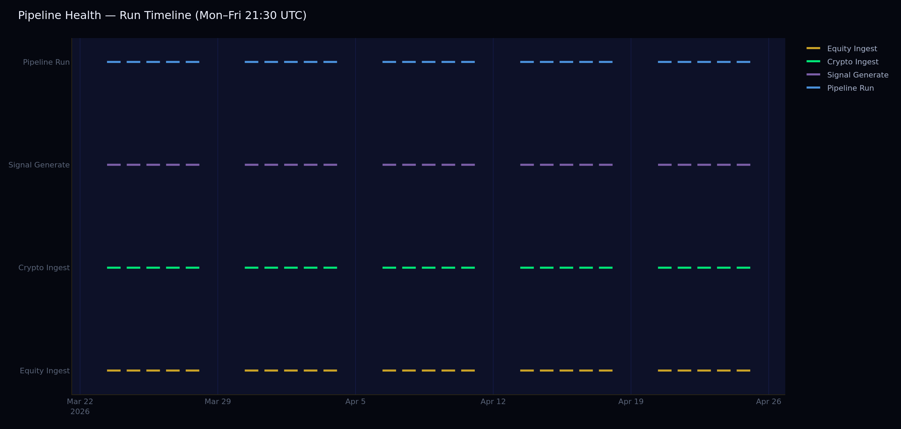

### Data Lab
Alt-data exploration hub with 5 live connectors and a tradability pipeline:

| Connector | Key required | What you get |
|---|---|---|
| FRED | Free key | 800k+ macro series (unemployment, CPI, yields, VIX…) |
| World Bank | None | GDP, inflation, labour, trade for 200+ countries |
| BLS | Optional free key (works without) | Payrolls, unemployment, CPI, PPI, JOLTS, productivity |
| Commodities | None | 40+ futures (crude, gold, corn…) + ETFs (GLD, USO…) |
| Alpha Vantage | Free key | EPS, P/E, revenue, earnings history per ticker |

Upload CSV/JSON, apply cleaning transforms (fill, outlier, resample, normalise), and run tradability checks (Spearman IC at multiple lags, rolling IC, multi-signal comparison, promote-to-feature flow).

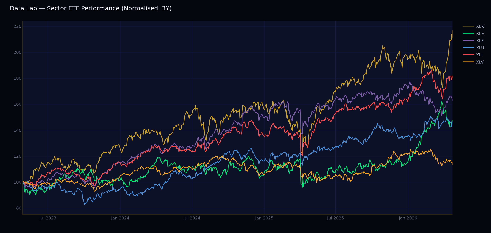

### Factor Analysis
IC computation, factor distribution, Hurst exponent, and factor correlation heatmap.

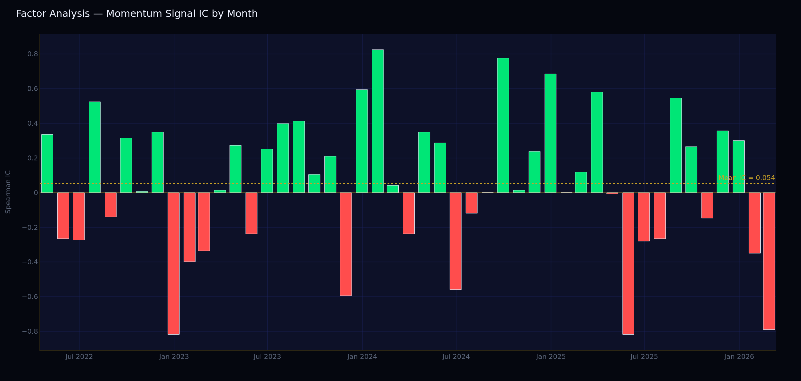

### Signal Analysis
IC decay with significance testing, regime-conditioned IC, turnover cost simulation, and composite signal builder.

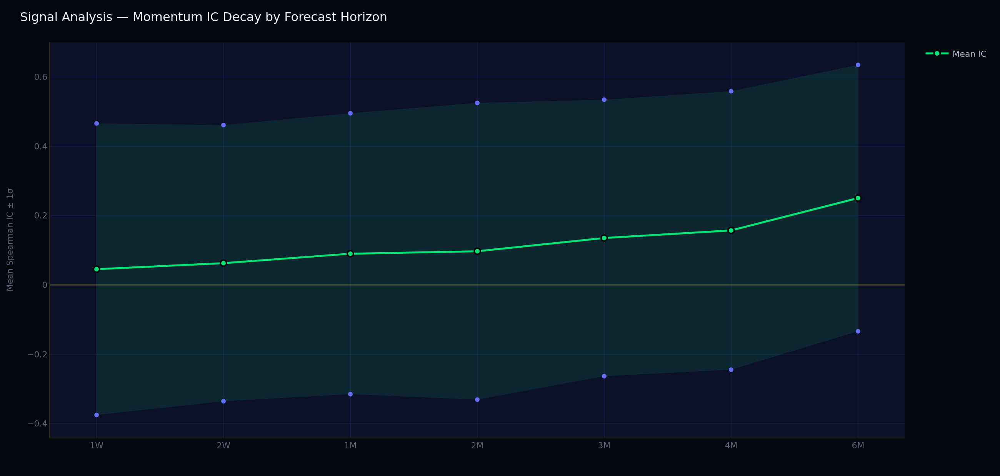

### Walk-Forward
Multi-fold OOS validation with hit rate, Sharpe stability scatter, and per-fold drawdown bars.

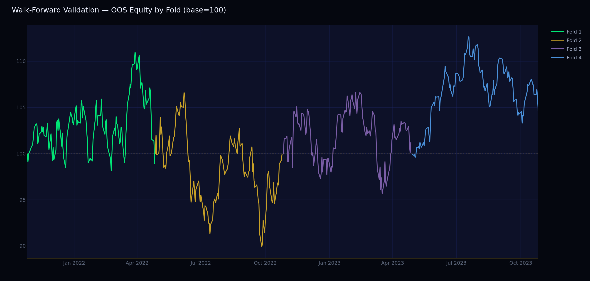

### Monte Carlo
Block-bootstrap fan chart, metric distributions (Sharpe/Calmar/Sortino/MaxDD), VaR/ES, ACF diagnostics, convergence checks.

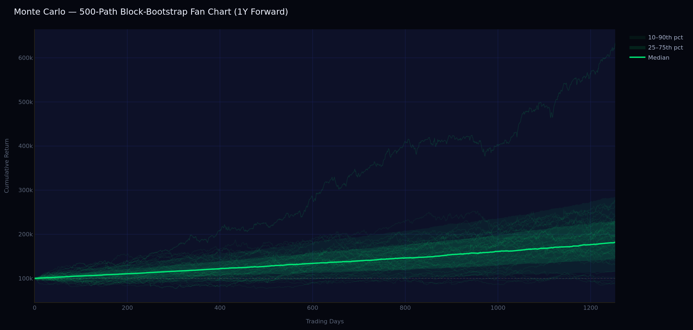

### Time Series
Welch PSD, FFT frequency filter, Haar wavelet decomposition, GBM simulation with all trajectories, autocorrelation.

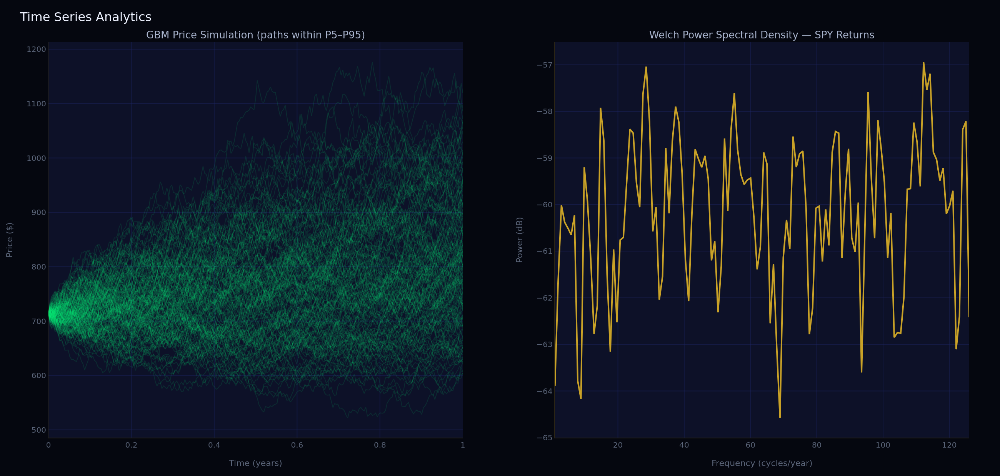

### Kalman Filter
Standalone TVP regression dashboard. Dynamic factor betas updated daily via Kalman predict-update loop. Shows filtered vs OLS betas with ±1σ confidence band, innovations, posterior variance, and factor loading heatmap.

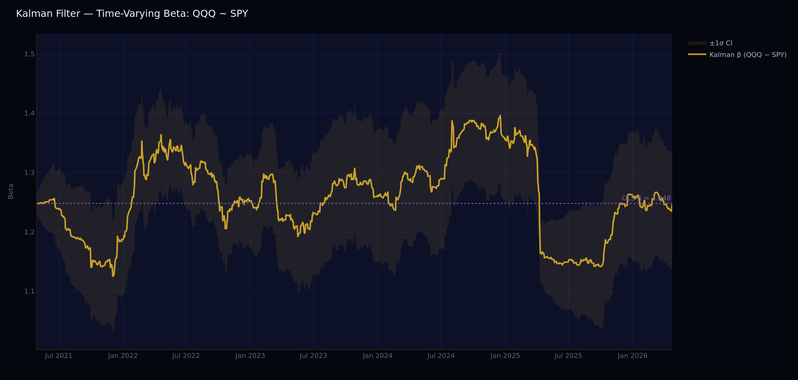

### Strategy Lab
Full strategy development environment: ACE code editor with syntax highlighting, backtest runner (subprocess JSON protocol), parameter sweep (Sharpe/CAGR/MaxDD heatmap), walk-forward IS/OOS split with overfitting ratio, persistent run history, AI coding assistant (Claude API, Apply-to-Editor).

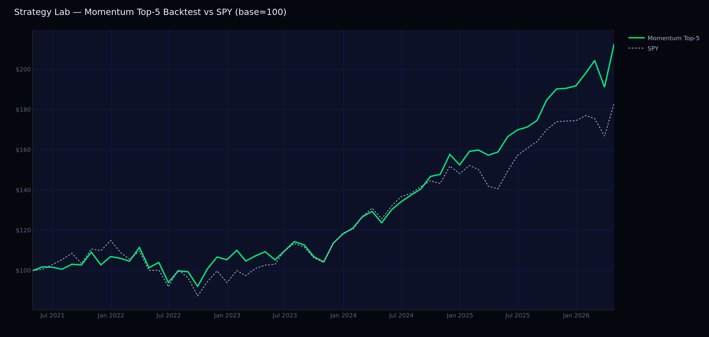

### Performance
Tearsheet for any saved blend config. Select from blends saved in the Blends tab — the equity curve is computed by blending each strategy's backtest returns by the saved weights.
- **Overview** — equity curve vs benchmark, trailing returns (grouped bars), annual returns bar chart
- **Portfolio** — holdings, sector donut, weight history, contribution analysis
- **Risk** — VaR/CVaR, stress scenarios, rolling vol/drawdown, factor exposure, return attribution
- **Analytics** — monthly heatmap, return distribution, correlation matrix, rolling Sharpe/Sortino, Q-Q plot

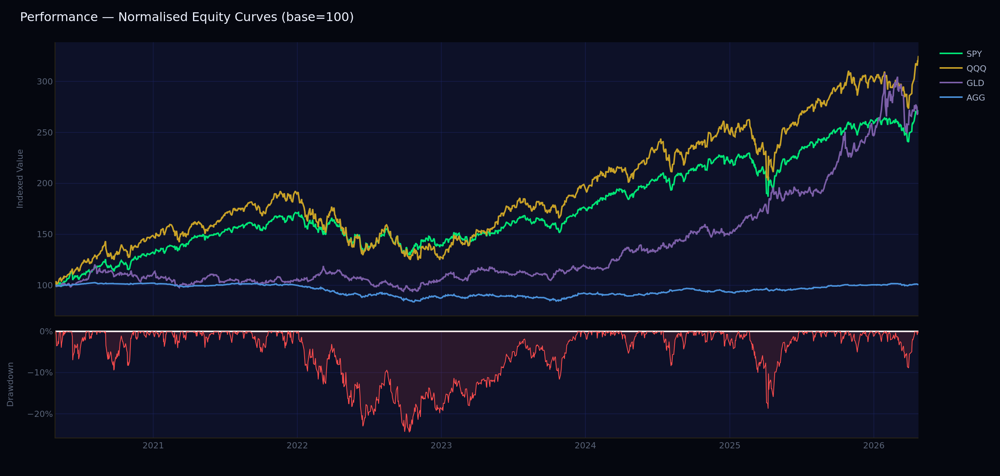

### Blends
Three-tab strategy comparison and blend optimisation tool (read-only — use Deployment to activate):
- **Overview** — all 9 strategies with equal-weight blend, blended equity curve vs SPY, P&L attribution
- **Comparison** — metrics table, overlaid equity curves, drawdown, rolling Sharpe, monthly return heatmaps
- **Optimizer** — correlation heatmap, 4 optimization methods with bootstrap CI bars, efficient frontier; **Save as Blend** button writes to `saved_blends.jsonl` for Performance analysis

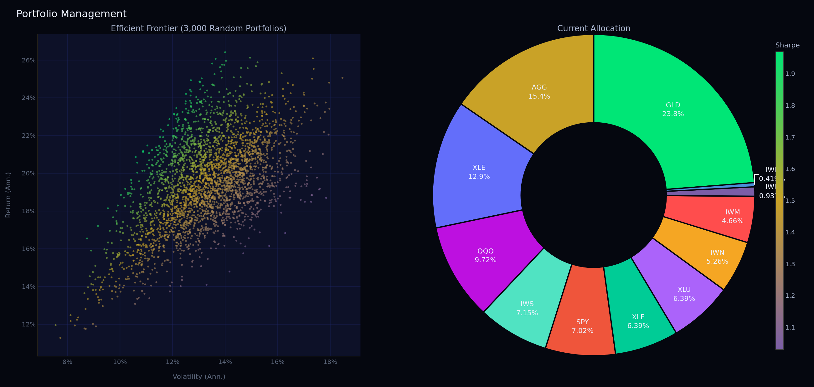

### Paper Trading
Live monitoring of the IBKR paper account (`DUQ368627`):
- Daily equity curve from `target_weights × bronze prices`, anchored at post-rebalance NAV snapshots
- Deployment version markers, drawdown shading, rebalance dots
- Daily P&L bar chart and rolling 21-day return
- Win/loss statistics: win rate, avg win/loss, payoff ratio, profit factor
- Current positions table (formatted weights + dollar values) and pie chart
- Trade history and slippage analysis

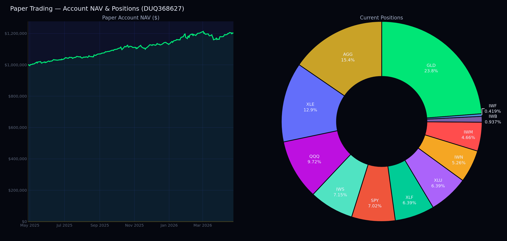

### Live Trading
Minimal IBKR live account monitor: TCP connection probe, read-only live snapshot (NAV + open positions), historical live NAV chart. Full live execution is triggered from the Portfolio → Trade tab.

### Deployment
The only tab where trades can be configured and executed:
- **Strategy Config** — toggle strategies active/inactive, set allocation weights (defaults to all unchecked); Check All / Uncheck All buttons; load weights from any saved blend
- **Drift Monitor** — target vs actual weight drift with alert thresholds
- **Trade** — IB paper/live execution with pre-flight check

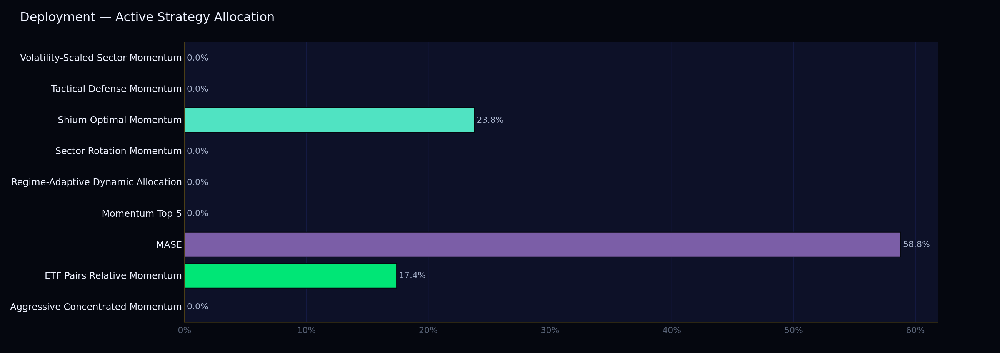

---

## Modules

### `config`
Central settings loaded from environment variables via `.env`. All paths, API keys, IBKR connection parameters, and alert tokens live here. Import with `from config.settings import ...`.

### `data_adapters`
Seven live connectors (six standalone adapters + one commodity wrapper around yfinance), each returning a validated Polars DataFrame:

| Adapter | Key | Data |
|---|---|---|
| `yfinance_adapter` | None | Equity/ETF OHLCV + 40+ commodity futures |
| `ccxt_adapter` | Exchange keys | Crypto OHLCV |
| `fred_adapter` | Free | 800k+ macro series |
| `worldbank_adapter` | None | 16k+ macro indicators, multi-country |
| `bls_adapter` | Optional free | Labour market, CPI, PPI, productivity |
| `alphavantage_adapter` | Free | EPS, P/E, revenue, earnings history |
| `commodities_adapter` | None | Futures + ETF price series (wraps yfinance) |

Price adapters handle retries (3 attempts, exponential backoff) and dead-letter logging to `logs/dead_letters.log`.

### `storage`
Bronze layer: partitioned Parquet files at `data/bronze/{asset_class}/daily/symbol=X/`. All writes are atomic (`.tmp` + `os.replace`) and file-locked to prevent concurrent corruption. Gold layer: derived artefacts (target weights, portfolio log, order journal, NAV history).

### `features`
Pure, side-effect-free feature computation. Key features: `momentum_12m_1m` (skip-month), `realized_vol_21d`. All features are point-in-time safe — no forward-looking data leaks.

### `signals`
Cross-sectional momentum ranking with monthly rebalance date generation. Composite signal blending and IC diagnostics.

### `backtest`
Vectorised backtest loop with per-trade cost models. `tearsheet_dict()` returns a plain dict for dashboard consumption. Walk-forward engine uses `dateutil.relativedelta` for correct month arithmetic.

### `portfolio`
- **`optimizer.py`**: five weighting methods (equal, inverse-vol, mean-variance, min-variance, max-Sharpe) implemented with cvxpy / PyPortfolioOpt / scipy.
- **`multi_strategy.py`**: discovers strategies from `strategies/`, runs backtests as subprocesses (via `tools/backtest_runner.py`), caches results, builds strategy return matrices, computes correlations, optimises cross-strategy allocations, blends symbol-level weights, reads/writes deployment config and deployment history.
- **`_backtest_cache.py`**: invalidates cache when strategy `.py` mtime changes or after 24 hours.

### `risk`
Pre-trade hard gate: if any limit is violated, `generate_signals.py` returns exit code 1 and does **not** write target weights. Includes historical VaR, Barra-style factor exposure, and 2008/2011/2015/COVID/2022 stress scenarios.

### `execution`
- **`ibkr_adapter.py`**: synchronous ib_insync wrapper targeting IB Gateway (paper port 4002, live port 4001). Waits up to 30 seconds for order fills.
- **`order_journal.py`**: append-only Parquet audit trail. Every order attempt is recorded before and after the broker call.
- **`trading_log.py`**: NAV snapshot written after every non-dry-run rebalance. Used by the Paper/Live Trading dashboards to anchor the equity curve.

### `orchestration`
- **`run_pipeline.py`**: chains ingest → signals. Writes `.pipeline_heartbeat.json` on completion. Sends ntfy/Pushover alerts on failure or success.
- **`generate_signals.py`**: reads `deployment_config.json`; if active strategies are configured it runs each strategy's `get_signal()` + `get_weights()` and blends by allocation weight. Falls back to default cross-sectional momentum if no config exists.
- **`rebalance.py`**: loads target weights, connects to broker (paper/ibkr/ccxt), runs pre-trade check, computes and places orders, reconciles positions, writes NAV snapshot. Accepts `--ibkr-host/port/client-id/live` flags for dashboard-triggered execution.
- **`_halt.py`**: checks for `QP_HALT` sentinel file. Called at the top of both `run_pipeline` and `run_rebalance`.

### `reports`
All dashboards share `_theme.py` for consistent dark styling. The `@st.cache_resource` pattern is used for heavy loaders; `@st.cache_data(ttl=N)` for data that can be refreshed.

### `strategies`
Each strategy lives in its own folder: `strategies/<slug>/<slug>.py`. The file must export `get_signal()`, `get_weights()`, `NAME`, `DESCRIPTION`, and `DEFAULT_PARAMS`. The Strategy Lab and Portfolio Management layer discover strategies automatically by scanning this directory.

Current strategies (9):

| Slug | Description |
|---|---|
| `momentum_top5` | Cross-sectional 12-1 momentum, equal-weight top-5. Canary baseline. |
| `aggressive_concentrated_momentum` | Concentrated momentum — fewer, higher-conviction positions. |
| `etf_pairs_relative_momentum` | Relative momentum within ETF pairs (equity vs bond, growth vs value). |
| `mase` | Mean-reversion + momentum ensemble with volatility scaling. |
| `regime_adaptive_dynamic_allocation` | 4-component regime score sets equity/cash split; skip-month momentum selects positions. |
| `sector_rotation_momentum` | Sector ETF rotation based on 12-1 momentum cross-sectional ranking. |
| `shium_optimal_momentum` | Optimised momentum factor with size/value tilts. |
| `tactical_defense_momentum` | Momentum with defensive rotation into bonds/cash in drawdown regimes. |
| `volatility_scaled_sector_momentum` | Sector momentum with inverse-volatility position sizing. |

### `research`
Pure-analytics time-series library (no Streamlit, no Plotly). All modules follow the typed-dataclass pattern.

- **`kalman_filter.py`** — TVP regression via Kalman predict-update loop (`KalmanResult` dataclass).
- **`long_memory.py`** — Hurst exponent via R/S analysis and DFA; `rolling_hurst()` for time-varying analysis.
- **`monte_carlo.py`** — circular block-bootstrap Monte Carlo with log-cumsum overflow protection.
- **`spectral.py`** — Welch PSD, dominant cycle detection, brick-wall FFT filter, Haar wavelet, GBM simulation, ACF.
- **`factor_analysis.py`** — Information Coefficient computation, `ICResult` dataclass, factor distribution statistics.
- **`walk_forward_runner.py`** — Loads prices/features, runs `backtest.walk_forward`, returns `WalkForwardResult`.

---

## Setup

```bash
# 1. Clone and enter
git clone https://github.com/micahabanschick/QuantPipe.git
cd QuantPipe

# 2. Install dependencies
uv sync

# 3. Copy and fill in secrets
cp .env .env.local   # or edit .env directly — it is gitignored
# Required: FRED_API_KEY
# For execution: IBKR_HOST, IBKR_PORT, IBKR_PAPER

# 4. Run historical backfill (first run only, ~2–5 minutes)
uv run python orchestration/backfill_history.py

# 5. Run the full pipeline (ingest + signals)
uv run python orchestration/run_pipeline.py

# 6. Launch the dashboard
uv run streamlit run app.py
```

### Optional dependencies

```bash
# Portfolio optimizers (cvxpy, PyPortfolioOpt)
uv sync --extra portfolio

# IBKR execution (ib_insync)
uv sync --extra execution

# All extras
uv sync --all-extras
```

### Environment variables (`.env`)

| Variable | Description | Default |
|---|---|---|
| `FRED_API_KEY` | FRED REST API key (Data Lab + macro ingestion) | — |
| `IBKR_HOST` | IB Gateway host | `127.0.0.1` |
| `IBKR_PORT` | IB Gateway API port | `4002` (paper) |
| `IBKR_CLIENT_ID` | API client ID | `1` |
| `IBKR_PAPER` | Paper mode flag | `true` |
| `NTFY_TOPIC` | ntfy.sh topic for pipeline alerts | — |
| `PUSHOVER_TOKEN` | Pushover app token (alternative to ntfy) | — |
| `PUSHOVER_USER` | Pushover user key | — |
| `B2_ACCOUNT_ID` | Backblaze B2 application key ID | — |
| `B2_APPLICATION_KEY` | Backblaze B2 application key secret | — |
| `B2_BUCKET` | Backblaze B2 bucket name | — |
| `ALPHA_VANTAGE_API_KEY` | Alpha Vantage fundamentals key (free at alphavantage.co) | — |
| `BLS_API_KEY` | BLS registration key — optional free key at bls.gov; works without one (25 req/day), key raises limit to 500 | — |
| `VAULT_ADDR` | HashiCorp Vault address (server only) | — |
| `VAULT_TOKEN` | HashiCorp Vault app token (server only) | — |

---

## Running the Pipeline

```bash
# Full daily pipeline (ingest + signals)
uv run python orchestration/run_pipeline.py

# Signals only (skip re-ingestion)
uv run python orchestration/run_pipeline.py --skip-ingest

# IBKR paper rebalance — dry run (computes orders, does not place)
uv run python orchestration/rebalance.py --broker ibkr --dry-run

# IBKR paper rebalance — places real paper orders
uv run python orchestration/rebalance.py --broker ibkr

# Live rebalance (real money — use with caution)
uv run python orchestration/rebalance.py --broker ibkr --ibkr-live

# Emergency kill-switch
touch QP_HALT       # stops next pipeline/rebalance run at startup
rm QP_HALT          # clears the halt

# Run tests
uv run pytest tests/ -m "not network"   # fast tests only
uv run pytest -m network                # include live-network tests
```

### Server schedule (systemd timers)

| Timer | Schedule | What it does |
|---|---|---|
| `quantpipe-pipeline.timer` | Mon–Fri 21:30 UTC | Ingest prices → generate signals → ntfy alert |
| `quantpipe-rebalance.timer` | Mon–Fri 22:30 UTC | Rebalance IBKR paper account against latest target weights |
| `quantpipe-backup.timer` | Daily 02:00 UTC | Sync `data/` to Backblaze B2 |

---

## Interactive Brokers Integration

QuantPipe connects to IB Gateway via `ib_insync`. Both paper and live sessions are supported.

### Port reference

| Application | Session | Port |
|---|---|---|
| IB Gateway | Paper | 4002 |
| IB Gateway | Live | 4001 |
| TWS | Paper | 7497 |
| TWS | Live | 7496 |

### IB Gateway setup (server)

IB Gateway runs headlessly on the server via IBC + Xvfb. It auto-starts on boot:

```bash
systemctl status quantpipe-ibgateway   # check status
journalctl -u quantpipe-ibgateway -n 30 --no-pager   # view logs
cat /var/log/quantpipe/ibc-*.txt | tail -20           # IBC diagnostic log
```

Configuration: `/opt/ibc/config.ini` — credentials, paper mode, port 4002, `AcceptIncomingConnectionAction=accept`.

### Execution flow

```
Portfolio tab → Deploy config  →  deployment_config.json + deployment_history.jsonl
run_pipeline.py                →  target_weights.parquet (blended across strategies)
rebalance.py --broker ibkr     →  IBKR orders → order_journal.parquet + trading_history.parquet
Paper Trading dashboard         →  equity curve with deployment markers
```

---

## Build Phases

| Phase | Description | Status |
|---|---|---|
| 0 | Project scaffold, config, storage layer, CI | ✅ Complete |
| 1 | Data ingestion (yfinance + CCXT + FRED), bronze layer | ✅ Complete |
| 2 | Feature engineering (momentum, vol), point-in-time safe | ✅ Complete |
| 3 | Backtest engine, walk-forward, tearsheets | ✅ Complete |
| 4 | Portfolio construction (cvxpy / PyPortfolioOpt), risk engine | ✅ Complete |
| 5 | Reporting dashboards (14 pages) | ✅ Complete |
| 6 | Paper trading loop: execution layer, rebalance orchestration | ✅ Complete |
| 7 | Multi-strategy portfolio management, IBKR Gateway integration, trading dashboards | ✅ Complete |
| 8 | Time-series analytics (Kalman, Hurst, spectral, GBM), Data Lab (FRED), 9-strategy suite | ✅ Complete |

---

## Design Principles

**One-way data flow.** Each layer consumes from the layer below and writes to the layer above. No module imports from a higher layer.

**Atomic writes everywhere.** Every Parquet write uses `.tmp` + `os.replace()`. File locks prevent concurrent corruption. The pipeline can be killed at any point and restarted safely.

**Hard gates, not soft warnings.** The pre-trade check in `generate_signals.py` and `rebalance.py` returns a non-zero exit code and refuses to write weights if any risk limit is violated.

**No silent fallbacks in optimisation.** Solver failures in `portfolio/optimizer.py` raise `RuntimeError` rather than silently returning equal weights. You should know when your optimizer fails.

**Strategies are pure functions.** `get_signal()` and `get_weights()` take DataFrames in, return DataFrames out. No I/O, no global state. Prices are injected by the runner, making strategies unit-testable without a storage layer.

**Kill-switch.** `touch QP_HALT` in the project root stops the pipeline and rebalancer immediately. Both scripts check for this file at startup.

**Deployment history is immutable.** Every call to `write_deployment_config()` appends to `deployment_history.jsonl` — it is never overwritten. This provides a permanent audit trail visible as vertical markers on the Paper Trading equity curve.
